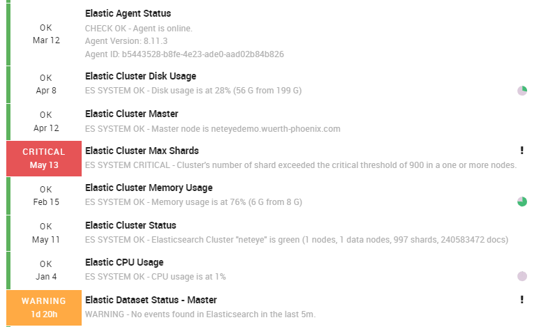
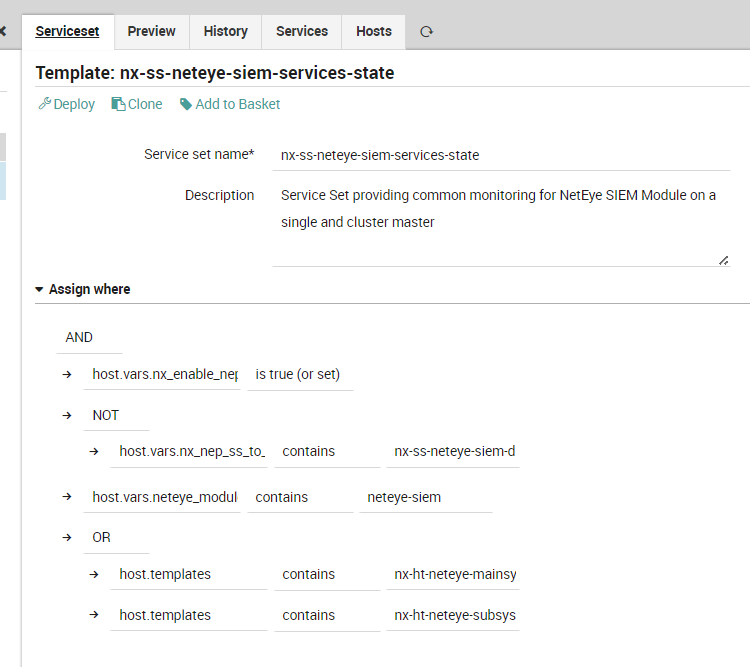

# NEP Monitoring SIEM

The `nep-monitoring-siem` package is the NEP designed to monitor the NetEye Elastic Stack modules. It provides comprehensive monitoring for all components of the SIEM module. With `nep-monitoring-siem` it is possible to perform monitoring of:

* Elasticsearch cluster (status, disk, memory, CPU, max shards, SLM policies)
* Logstash pipelines, events throughput (EPS), queue depth, and heap usage
* Filebeat forwarding agents
* Kibana response time and task manager
* Elastic Agent and Elastic Endpoint status via Fleet API
* APM Server availability
* Elastic dataset ingestion status and transforms
* Elastic Watchers and Blockchain (EBP) integrity checks

# Table of Contents

1. [Prerequisites](#prerequisites)
2. [Installation](#installation)
3. [Packet Contents](#packet-contents)
4. [Usage](#usage)


## Prerequisites

This package can be installed on systems running the software described below. Systems with equivalent components are also suitable for installation.

| Sofware Version | Version |
| --- | ----------- |
| NetEye | 4.44+ |
| nep-common | 0.1.0+ |
| nep-monitoring-core | 0.0.6+ |


##### Required NetEye Modules

| NetEye Module |
| --- |
| Core |
| Elastic Stack |


### External dependencies

* Ruby: Version 2.0+


## Installation

### Before Installation

There is no need to perform any action before installing this NEP


### NEP Installation

To setup Package `nep-monitoring-siem`, just use the Setup Utility:

```
nep-setup install nep-monitoring-siem
```


**Please Note**:

1. The Webhook created for the EBP Verification is autogenerated, and you will need to manually change the secret token on `/etc/neteye-dpo` with the content of `/root/.pwd_webhook_nx_elproxy_verification`.
2. All Docker Blockchain Verification configurations under `/etc/neteye-dpo` must have the same value for `webhook_token` since Tornado does not support multiple webhook tokens for the same webhook id.


## Packet Contents

This NEP provides Director objects, Icinga2 configuration, check plugins, and Tornado rules for monitoring the NetEye Elastic Stack (SIEM module).

### Director/Icinga Objects

The Package contains the following Director Objects.

| Object Type | Object Name | Editable | Containing File |
| --- | --- | --- | --- |
| Director Data List | [NX] Elastic Check Types List | No | baskets/import/nep-monitoring-siem-01-datalist.json |
| Director Data List | [NX] Kibana Check Types List | No | baskets/import/nep-monitoring-siem-01-datalist.json |
| Director Data List | [NX] Elastic Agent Types List | No | baskets/import/nep-monitoring-siem-01-datalist.json |
| Director Command | nx-c-check-elastic-slm-policy | No | baskets/import/nep-monitoring-siem-02-command.json |
| Director Command | nx-c-check-elastic-slm-status | No | baskets/import/nep-monitoring-siem-02-command.json |
| Director Command | nx-c-check_elastic_blockchain_status | No | baskets/import/nep-monitoring-siem-02-command.json |
| Director Command | nx-c-check-es-system | No | baskets/import/nep-monitoring-siem-02-command.json |
| Director Command | nx-c-check-filebeat | No | baskets/import/nep-monitoring-siem-02-command.json |
| Director Command | nx-c-check-kibana-stats | No | baskets/import/nep-monitoring-siem-02-command.json |
| Director Command | nx-c-check-logstash | No | baskets/import/nep-monitoring-siem-02-command.json |
| Director Command | nx-c-check-logstash-pipeline | No | baskets/import/nep-monitoring-siem-02-command.json |
| Director Command | nx-c-check-logstash-events | No | baskets/import/nep-monitoring-siem-02-command.json |
| Director Command | nx-c-check-logstash-queue | No | baskets/import/nep-monitoring-siem-02-command.json |
| Director Command | nx-c-check_elastic_ingest_status | No | baskets/import/nep-monitoring-siem-02-command.json |
| Director Command | nx-c-check-elastic-agent-status | No | baskets/import/nep-monitoring-siem-02-command.json |
| Director Command | nx-c-check-apm-server-status | No | baskets/import/nep-monitoring-siem-02-command.json |
| Director Command | nx-c-check-elastic-endpoint-status | No | baskets/import/nep-monitoring-siem-02-command.json |
| Director Command | nx-c-fleet-agent-status | No | baskets/import/nep-monitoring-siem-02-command.json |
| Director Command | nx-c-endpoint-agent-status | No | baskets/import/nep-monitoring-siem-02-command.json |
| Director Command | nx-c-check_elastic_dataset_status | No | baskets/import/nep-monitoring-siem-02-command.json |
| Director Command | nx-c-check_elastic_transforms_status | No | baskets/import/nep-monitoring-siem-02-command.json |
| Director Command | nx-c-check_elastic_remove_duplicate_ebp_iterations | No | baskets/import/nep-monitoring-siem-02-command.json |
| Director Command | nx-c-check-elastic-dataset-object | No | baskets/import/nep-monitoring-siem-02-command.json |
| Director Command | nx-c-check_elastic_disk_watermark_flooding | No | baskets/import/nep-monitoring-siem-02-command.json |
| Director Command | nx-c-check_elastic_watchers_status | No | baskets/import/nep-monitoring-siem-02-command.json |
| Director Service Template | nx-st-agent-elastic | No | baskets/import/nep-monitoring-siem-04-service.json |
| Director Service Template | nx-st-agent-elastic-neteye | No | baskets/import/nep-monitoring-siem-04-service.json |
| Director Service Template | nx-st-agent-filebeat | No | baskets/import/nep-monitoring-siem-04-service.json |
| Director Service Template | nx-st-agent-filebeat-neteye | No | baskets/import/nep-monitoring-siem-04-service.json |
| Director Service Template | nx-st-agent-kibana | No | baskets/import/nep-monitoring-siem-04-service.json |
| Director Service Template | nx-st-agent-logstash | No | baskets/import/nep-monitoring-siem-04-service.json |
| Director Service Template | nx-st-agent-logstash-health | No | baskets/import/nep-monitoring-siem-04-service.json |
| Director Service Template | nx-st-agent-logstash-pipeline | No | baskets/import/nep-monitoring-siem-04-service.json |
| Director Service Template | nx-st-agent-logstash-events | No | baskets/import/nep-monitoring-siem-04-service.json |
| Director Service Template | nx-st-agent-logstash-neteye | No | baskets/import/nep-monitoring-siem-04-service.json |
| Director Service Template | nx-st-agent-logstash-queue | No | baskets/import/nep-monitoring-siem-04-service.json |
| Director Service Template | nx-st-agentless-apm-server-check | No | baskets/import/nep-monitoring-siem-04-service.json |
| Director Service Template | nx-st-agentless-elastic-agent-check | No | baskets/import/nep-monitoring-siem-04-service.json |
| Director Service Template | nx-st-agentless-elastic-dataset-object | No | baskets/import/nep-monitoring-siem-04-service.json |
| Director Service Template | nx-st-agentless-elastic-dataset-status | No | baskets/import/nep-monitoring-siem-04-service.json |
| Director Service Template | nx-st-agentless-elastic-endpoint-check | No | baskets/import/nep-monitoring-siem-04-service.json |
| Director Service Template | nx-st-agentless-elastic-slm-policy | No | baskets/import/nep-monitoring-siem-04-service.json |
| Director Service Template | nx-st-agentless-elastic-slm-status | No | baskets/import/nep-monitoring-siem-04-service.json |
| Director Service Template | nx-st-agentless-elastic-transforms-status | No | baskets/import/nep-monitoring-siem-04-service.json |
| Director Service Template | nx-st-agentless-elastic-watchers-status | No | baskets/import/nep-monitoring-siem-04-service.json |
| Director Service Template | nx-st-agentless-restapi-elastic-blockchain-status | No | baskets/import/nep-monitoring-siem-04-service.json |
| Director Service Template | nx-st-agentless-restapi-elastic-ingest-status | No | baskets/import/nep-monitoring-siem-04-service.json |
| Director Service Template | nx-st-check_elastic_disk_watermark_flooding | No | baskets/import/nep-monitoring-siem-04-service.json |
| Director Service Template | nx-st-endpoint-agent-status | No | baskets/import/nep-monitoring-siem-04-service.json |
| Director Service Template | nx-st-fleet-agent-status | No | baskets/import/nep-monitoring-siem-04-service.json |
| Director Service Set | nx-ss-agent-linux-elastic-agent-state | No | baskets/import/nep-monitoring-siem-05-serviceset.json |
| Director Service Set | nx-ss-agent-linux-elastic-endpoint-state | No | baskets/import/nep-monitoring-siem-05-serviceset.json |
| Director Service Set | nx-ss-agent-windows-elastic-agent-state | No | baskets/import/nep-monitoring-siem-05-serviceset.json |
| Director Service Set | nx-ss-agent-windows-elastic-endpoint-state | No | baskets/import/nep-monitoring-siem-05-serviceset.json |
| Director Service Set | nx-ss-elastic-blockchain-extras | No | baskets/import/nep-monitoring-siem-05-serviceset.json |
| Director Service Set | nx-ss-neteye-endpoint-apm-server-state | No | baskets/import/nep-monitoring-siem-05-serviceset.json |
| Director Service Set | nx-ss-neteye-endpoint-elastic-agent-extras | No | baskets/import/nep-monitoring-siem-05-serviceset.json |
| Director Service Set | nx-ss-neteye-endpoint-elastic-agent-state | No | baskets/import/nep-monitoring-siem-05-serviceset.json |
| Director Service Set | nx-ss-neteye-endpoint-elastic-state | No | baskets/import/nep-monitoring-siem-05-serviceset.json |
| Director Service Set | nx-ss-neteye-endpoint-filebeat-state | No | baskets/import/nep-monitoring-siem-05-serviceset.json |
| Director Service Set | nx-ss-neteye-endpoint-kibana-state | No | baskets/import/nep-monitoring-siem-05-serviceset.json |
| Director Service Set | nx-ss-neteye-endpoint-logstash-extras | No | baskets/import/nep-monitoring-siem-05-serviceset.json |
| Director Service Set | nx-ss-neteye-endpoint-logstash-state | No | baskets/import/nep-monitoring-siem-05-serviceset.json |
| Director Service Set | nx-ss-neteye-local-extras | No | baskets/import/nep-monitoring-siem-05-serviceset.json |
| Director Service Set | nx-ss-neteye-local-siem | No | baskets/import/nep-monitoring-siem-05-serviceset.json |
| Director Service Set | nx-ss-neteye-siem-disks-state | No | baskets/import/nep-monitoring-siem-05-serviceset.json |
| Director Service Set | nx-ss-neteye-siem-extras | No | baskets/import/nep-monitoring-siem-05-serviceset.json |
| Director Service Set | nx-ss-neteye-siem-services-state | No | baskets/import/nep-monitoring-siem-05-serviceset.json |
| Director Service Set | nx-ss-neteye-siem-units-state | No | baskets/import/nep-monitoring-siem-05-serviceset.json |
| Icinga2 Configuration | nx-dependency-elastic-agent | Yes | custom_files/neteye_shared_root/icinga2/conf/icinga2/conf.d/nx-dependency-elastic-agent.conf |


#### Host Templates

This NEP doesn't provide any Host Template definition


#### Data Lists

The following Data Lists can be freely customized by the End User. Their purpose is to provide easy data filling to better describe the monitoring environment.

| Data List name | Description |
| --- | --- |
| [NX] Elastic Check Types List | Check type selector for `nx-c-check-es-system` (cpu, disk, master, maxshards, mem, status) |
| [NX] Kibana Check Types List | Check type selector for `nx-c-check-kibana-stats` (rt = Response Time, task = Task Manager) |
| [NX] Elastic Agent Types List | Agent type selector (all, auditbeat, elastic_agent, filebeat, logstash, metricbeat, packetbeat, winlogbeat) |


#### Service Templates

The following Service Templates can be used to freely create Service Objects, Service Apply Rules or Service Sets.

_Remember to not edit these Service Templates as they will be restored/updated at the next NEP Package update_:

* `nx-st-agent-elastic` - Base template for Elasticsearch checks via Icinga agent
* `nx-st-agent-elastic-neteye` - Elasticsearch check template pre-configured for the NetEye local Elasticsearch (with TLS cert)
* `nx-st-agent-filebeat` - Base template for Filebeat checks via Icinga agent
* `nx-st-agent-filebeat-neteye` - Filebeat check template pre-configured for the NetEye local Filebeat instance
* `nx-st-agent-kibana` - Kibana stats check template via Icinga agent
* `nx-st-agent-logstash` - Base template for Logstash checks via Icinga agent
* `nx-st-agent-logstash-health` - Logstash health (CPU, heap, file descriptors) check template
* `nx-st-agent-logstash-pipeline` - Logstash pipeline in-flight events check template
* `nx-st-agent-logstash-events` - Logstash total EPS check template
* `nx-st-agent-logstash-neteye` - Logstash check template pre-configured for the NetEye local Logstash instance
* `nx-st-agent-logstash-queue` - Logstash persistent queue size check template
* `nx-st-agentless-apm-server-check` - APM Server status check via Fleet API (agentless)
* `nx-st-agentless-elastic-agent-check` - Elastic Agent status check via Fleet API (agentless)
* `nx-st-agentless-elastic-dataset-object` - Elastic dataset object check (agentless)
* `nx-st-agentless-elastic-dataset-status` - Elastic dataset ingestion status check via Tornado webhook (agentless)
* `nx-st-agentless-elastic-endpoint-check` - Elastic Endpoint status check via Elasticsearch (agentless)
* `nx-st-agentless-elastic-slm-policy` - Elasticsearch SLM policy configuration check (agentless)
* `nx-st-agentless-elastic-slm-status` - Elasticsearch SLM snapshot status check (agentless)
* `nx-st-agentless-elastic-transforms-status` - Elasticsearch transforms status check via Tornado webhook (agentless)
* `nx-st-agentless-elastic-watchers-status` - Elasticsearch watchers status check via Tornado webhook (agentless)
* `nx-st-agentless-restapi-elastic-blockchain-status` - Elastic Blockchain (EBP) integrity check via REST API (agentless)
* `nx-st-agentless-restapi-elastic-ingest-status` - Elastic ingest pipeline status check via REST API (agentless)
* `nx-st-check_elastic_disk_watermark_flooding` - Elasticsearch disk flood watermark threshold check
* `nx-st-endpoint-agent-status` - Endpoint agent status template (agentless, NetEye-local)
* `nx-st-fleet-agent-status` - Fleet agent status template (agentless, NetEye-local)


#### Services Sets

The following Service Sets can be used to freely monitor Host Objects.

_Remember to not edit these Service Sets because they will be restored/updated at the next NEP Package update_:

* `nx-ss-agent-linux-elastic-agent-state` - Monitoring for Elastic Agent Service on Linux hosts with Icinga agent
  * Elastic Agent Status
  * Unit Elastic Agent State
* `nx-ss-agent-windows-elastic-agent-state` - Monitoring for Elastic Agent Service on Windows hosts with Icinga agent
  * Elastic Agent Status
  * Service Elastic Agent Status
* `nx-ss-agent-linux-elastic-endpoint-state` - Monitoring for Elastic Endpoint Service on Linux hosts with Icinga agent
  * Elastic Endpoint Status
  * Unit Elastic Endpoint State
* `nx-ss-agent-windows-elastic-endpoint-state` - Monitoring for Elastic Endpoint Service on Windows hosts with Icinga agent
  * Elastic Endpoint Status
  * Service Elastic Endpoint Status
* `nx-ss-elastic-blockchain-extras` - Extra monitoring for Elastic Blockchain (EBP) on EBP-enabled hosts
  * Elastic Blockchain Check
* `nx-ss-neteye-endpoint-apm-server-state` - Monitoring for APM Server on NetEye endpoints
  * APM Server Status
* `nx-ss-neteye-endpoint-elastic-agent-extras` - Extra monitoring for Elastic Agent on NetEye endpoints
  * Elasticsearch Current ESTABLISHED Connection
  * Elastic Agent Total EPS
* `nx-ss-neteye-endpoint-elastic-agent-state` - Monitoring for Elastic Agent Service on NetEye endpoints
  * Elastic Agent Status
  * Unit Elastic Agent State
* `nx-ss-neteye-endpoint-elastic-state` - Monitoring for Elasticsearch Service on NetEye endpoints
  * Unit Elasticsearch State
  * Disk Elasticsearch Free space
  * Elastic CPU Usage
  * Elastic Memory Usage
  * Elastic Disk Usage
  * Elastic Disk Watermark Flooding
* `nx-ss-neteye-endpoint-filebeat-state` - Monitoring for Filebeat Service on NetEye endpoints
  * Filebeat Status
  * Unit FileBeat State
* `nx-ss-neteye-endpoint-kibana-state` - Monitoring for Kibana Service on NetEye endpoints
  * Disk Kibana Free Space
  * Kibana Max Response Time
  * Kibana Task Manager Status
  * Unit Kibana State
* `nx-ss-neteye-endpoint-logstash-extras` - Extra monitoring for Logstash on NetEye endpoints
  * Logstash Current ESTABLISHED Connection
* `nx-ss-neteye-endpoint-logstash-state` - Monitoring for Logstash Service on NetEye endpoints
  * Logstash Status
  * Logstash Total EPS
  * Unit Logstash State
* `nx-ss-neteye-local-extras` - Extra checks on NetEye Local
  * Elastic Dataset Status - neteye_system_internal
* `nx-ss-neteye-local-siem` - All checks needed for SIEM module on NetEye Local
  * Fleet Agent Status
  * Endpoint Agent Status
  * Elastic SLM Policy
  * Elastic SLM Status
  * Elastic Transforms Status
  * Elastic Watchers Status
* `nx-ss-neteye-siem-disks-state` - Disk space monitoring for SIEM cluster components
  * Disk Tornado RSyslog collector Free space
  * Disk FileBeat Free space
  * Disk Elastic Blockchain Proxy Free space
  * Disk Logstash Free space
  * Disk RSyslog-Logmanager Free space
* `nx-ss-neteye-siem-extras` - Extra checks on SIEM hosts (Log Manager enabled)
  * Elastic Datasets Check
* `nx-ss-neteye-siem-services-state` - Monitoring for NetEye SIEM Module on single node and cluster master
  * Elastic Cluster Status
  * Elastic Cluster Master
  * Elastic Cluster Max Shards
  * Elastic Cluster Disk Usage
  * Elastic Cluster Memory Usage
  * Filebeat Status
  * Logstash Status
  * Logstash Total EPS
  * Logstash Queue EBP Status
  * Elastic Dataset Status - Master
* `nx-ss-neteye-siem-units-state` - Systemd unit monitoring for SIEM module on single node and cluster master
  * Unit RSyslog-Logmanager State
  * Unit Elastic Blockchain Proxy State
  * Unit Logstash State
  * Unit FileBeat State


#### Commands

| Icinga Command | File Path |
| --- | --- |
| nx-c-check-elastic-slm-policy | /neteye/shared/monitoring/plugins/check_elastic_slm.py |
| nx-c-check-elastic-slm-status | /neteye/shared/monitoring/plugins/check_elastic_slm.py |
| nx-c-check_elastic_blockchain_status | /neteye/shared/monitoring/plugins/check_elastic_blockchain_status.py |
| nx-c-check-es-system | /neteye/shared/monitoring/plugins/check_es_system.sh |
| nx-c-check-filebeat | /neteye/shared/monitoring/plugins/check_filebeat |
| nx-c-check-kibana-stats | /neteye/shared/monitoring/plugins/check_kibana_stats.sh |
| nx-c-check-logstash | /neteye/shared/monitoring/plugins/check_logstash |
| nx-c-check-logstash-pipeline | /neteye/shared/monitoring/plugins/check_logstash |
| nx-c-check-logstash-events | /neteye/shared/monitoring/plugins/check_logstash_events.sh |
| nx-c-check-logstash-queue | /neteye/shared/monitoring/plugins/check_logstash_queue.sh |
| nx-c-check_elastic_ingest_status | /neteye/shared/monitoring/plugins/check_elastic_ingest_status.py |
| nx-c-check-elastic-agent-status | /neteye/shared/monitoring/plugins/check_elastic_agent_status.sh |
| nx-c-check-apm-server-status | /neteye/shared/monitoring/plugins/check_apm_server_status.sh |
| nx-c-check-elastic-endpoint-status | /neteye/shared/monitoring/plugins/check_elastic_endpoint_status.sh |
| nx-c-fleet-agent-status | /neteye/shared/monitoring/plugins/fleet-agent-status.sh |
| nx-c-endpoint-agent-status | /neteye/shared/monitoring/plugins/endpoint-agent-status.sh |
| nx-c-check_elastic_dataset_status | /neteye/shared/monitoring/plugins/check_elastic_dataset_status.py |
| nx-c-check_elastic_transforms_status | /neteye/shared/monitoring/plugins/check_elastic_transforms_status.py |
| nx-c-check_elastic_remove_duplicate_ebp_iterations | /neteye/shared/monitoring/plugins/check_elastic_remove_duplicate_ebp_iterations.py |
| nx-c-check-elastic-dataset-object | /neteye/shared/monitoring/plugins/check_elastic_dataset_object.py |
| nx-c-check_elastic_disk_watermark_flooding | /neteye/shared/monitoring/plugins/check_elastic_disk_watermark_flooding.py |
| nx-c-check_elastic_watchers_status | /neteye/shared/monitoring/plugins/check_elastic_watchers_status.py |


#### Notification

This NEP doesn't provide any Notification definition


### Automation

This NEP doesn't provide any Automation


### Tornado Rules

The following Tornado rules are provided, organised into four rule groups:

**nx_elastic_dataset** (Tornado filter + ruleset):

* `ElasticAgent_Beats_Logstash_no_error` - Creates a Service Object with status OK when datasets for a specific Elasticsearch namespace/tenant are found within the defined check interval
* `ElasticAgent_Beats_Logstash_error` - Creates a Service Object with status CRITICAL when no events are found for a specific Elasticsearch Dataset within the defined timestamp

**nx_elastic_transforms** (Tornado filter + ruleset):

* `name_extract` - Extracts the transform name from the incoming event payload
* `Elastic_Transforms_OK` - Creates a Service Object reflecting the status OK for a specific Elasticsearch Transform
* `Elastic_Transform_Warning` - Creates a Service Object reflecting the status WARNING for a specific Elasticsearch Transform
* `Elastic_Transform_Critical` - Creates a Service Object reflecting the status CRITICAL for a specific Elasticsearch Transform
* `Elastic_Transforms_Unknown` - Creates a Service Object reflecting the status UNKNOWN for a specific Elasticsearch Transform

**nx_elastic_watchers** (Tornado filter + ruleset):

* `Elastic_Watchers_Critical` - Creates a Service Object reflecting the status CRITICAL for a specific Elasticsearch Watcher
* `Elastic_Watchers_OK` - Creates a Service Object reflecting the status OK for a specific Elasticsearch Watcher

**nx_elproxy_verification** (Tornado filter + ruleset):

* Blockchain verification and duplicate EBP iteration removal rules for the Elastic Blockchain Proxy (EBP)

The Tornado webhook collector configuration files are deployed to:

* `custom_files/neteye_shared_root/tornado_webhook_collector/conf/webhooks/nx-elastic-dataset.json`
* `custom_files/neteye_shared_root/tornado_webhook_collector/conf/webhooks/nx-elastic-transforms.json`
* `custom_files/neteye_shared_root/tornado_webhook_collector/conf/webhooks/nx-elastic-watchers.json`
* `custom_files/neteye_shared_root/tornado_webhook_collector/conf/webhooks/elproxy_verification.json`

**Please Note**:

1. The Webhook created for the EBP Verification is autogenerated, and you will need to manually change the secret token on `/etc/neteye-dpo` with the content of `/root/.pwd_webhook_nx_elproxy_verification`.
2. All Docker Blockchain Verification configurations under `/etc/neteye-dpo` must have the same value for `webhook_token` since Tornado does not support multiple webhook tokens for the same webhook id.


### Dashboard ITOA

This NEP doesn't provide any ITOA Dashboards


### Metrics

This NEP doesn't generate any Performance Data from its commands


## Usage


### Examples



#### Using a host template provided by the NEP

No Host Template provided by this NEP


#### Using a service template provided by the NEP

Example of Service Template `nx-ss-neteye-siem-services-state`:

